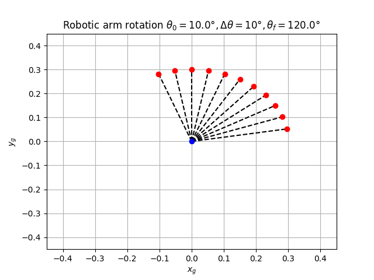
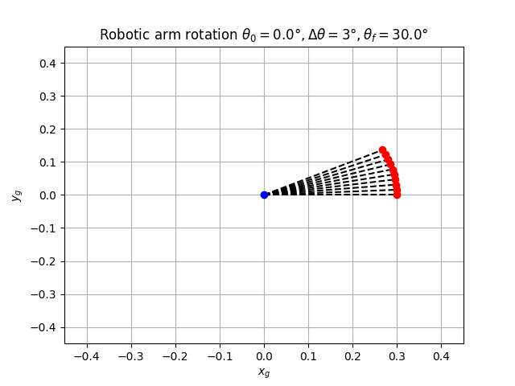
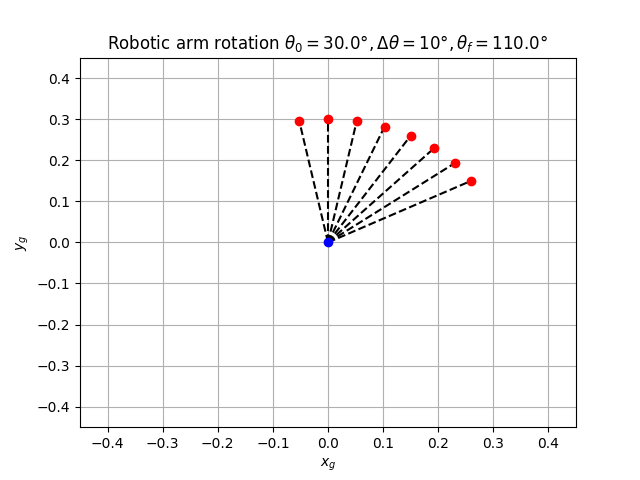
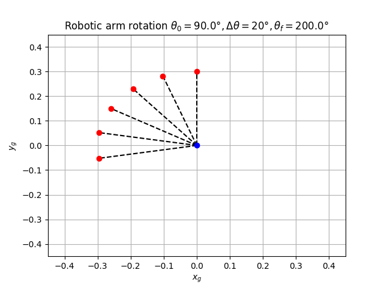

# Rotation arm robot

## Program 

This program displays the rotation of a robotic arm. Use the command in this form to create the display:

```bash
./rotation_matrix.py -initial_angle 90 -final_angle 420 -rotation 25 -filename robo1.png
```



## Learning objectives
In this assignment, you will apply pure-rotation transformations to a single-link robotic arm to
predict the position of its end effector - see Figure 1.

## Materials

- A personal computer running Linux1 
- Internet connectivity, as you may need to install Python libraries
- Python ≥ 3.10
- Recommended Python libraries: numpy, matplotlib, plotly
- Optionally: PyCharm, IDE, Visual Studio Code, Sublime, Atom, vim, Gedit, etc

## Methodology

1. First read the arguments from the command line
2. Define a function to create a rotation matrix
3. Initialize all the vectors that will be used and the initial coord
4. Apply the rotation matrix with constant rotation until the angle reaches the final angle
5. Display and print the recorded data
6. Plot each point from the origin to the point to show how the arm moves

## Results and analysis

**Case 1:** 

```
./rotation_matrix.py -initial_angle 0 -final_angle 30 -rotation 3 -filename rotation1.png
```



**Case 2:** 

```
./rotation_matrix.py -initial_angle 30 -final_angle 110 -rotation 10 -filename rotation2.png
```



**Case 3:** 

```
./rotation_matrix.py -initial_angle 90 -final_angle 200 -rotation 20 -filename rotation3.png
```



As you can see, each iteration, the rotation matrix rotates the point around the origin by a constant amount, so if we applied iteratively the operation, we could reach the final angle. 
Also, the same effect would have happened if we applied a rotation matrix with the final angle once, because the sum of the rotations equal the final rotation. 

# Conclusions

The rotation matrix allows to modify vectors and rotate them in a global context. This is very useful with robotic arms, because they could be applied several times and sum up to account for every arm and joint of the robot

