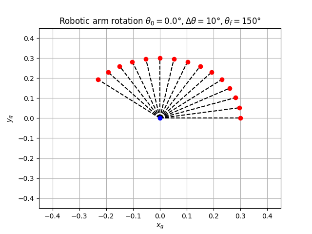

# Rotation arm robot

## Learning objectives
In this assignment, you will apply pure-rotation transformations to a single-link robotic arm to
predict the position of its end effector - see Figure 1.

## Materials

- A personal computer running Linux1 
- Internet connectivity, as you may need to install Python libraries
- Python ≥ 3.10
- Recommended Python libraries: numpy, matplotlib, plotly
- Optionally: PyCharm, IDE, Visual Studio Code, Sublime, Atom, vim, Gedit, etc

## Methodology

1. First read the arguments from the command line
2. Define a function to create a rotation matrix
3. Initialize all the vectors that will be used and the initial coord
4. Apply the rotation matrix with constant rotation until the angle reaches the final angle
5. Display and print the recorded data
6. Plot each point from the origin to the point to show how the arm moves

## Results and analysis


## Program 

This program displays the rotation of a robotic arm. Use the command in this form to create the display:

```bash
./rotation_matrix.py -initial_angle 90 -final_angle 420 -rotation 25"
```


